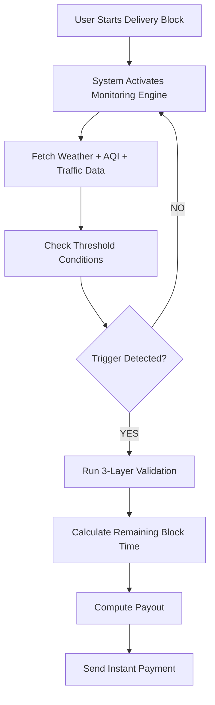

# 🛡️ GigShield: Parametric AI Insurance for the Gig Economy
Subtitle: Defending Income. Detecting Fraud. Surviving Market Volatility.

📌 1. Executive Summary
GigShield is an AI-driven parametric insurance platform engineered to provide a financial safety net for gig workers—specifically Amazon Flex delivery partners. By leveraging real-world environmental data (weather, pollution, traffic), GigShield automates income protection. Unlike traditional insurance, it utilizes a Zero-Touch Model, triggering instant payouts without manual claims or human verification.

🚨 2. The Problem Landscape

2.1 Environmental Volatility
India’s gig workforce is highly susceptible to "Acts of God" and urban disruptions. Rainfall, severe AQI spikes, and gridlock traffic do not just slow down work; they halt it.

Income Gap: Workers are paid per completed block. Partial disruptions result in 100% loss of the remaining block's potential earnings.

2.2 The "Market Crash" & Fraud Risk
Traditional GPS-based insurance is vulnerable to coordinated exploitation.

The Threat: Fraud rings using "Fake GPS" apps can simulate disruptions to trigger mass payouts, potentially draining platform liquidity in minutes.

💡 3. The Solution: GigShield
GigShield bridges the gap between worker protection and platform solvency through a mathematically precise compensation model.

👤 Persona Focus: Amazon Flex
By targeting the block-based model, GigShield can calculate losses with high granularity:

4-Hour Block (₹500):
2 hours lost = 50% payout (₹250)
1 hour lost = 25% payout (₹125)

⚙️ 4. Operational Workflow

Onboarding: Secure linking of Amazon Flex profiles and UPI-based payout IDs.
Dynamic Subscription: Micro-premiums (e.g., ₹20/week) adjusted via AI based on regional risk profiles.
Autonomous Monitoring: Continuous polling of Weather, AQI, and Traffic APIs.
Parametric Trigger: If rainfall exceeds 15mm/hr or traffic delay indices cross a specific threshold, the trigger activates.
Instant Settlement: Pro-rated compensation is pushed immediately to the worker's wallet.

🔄 Workflow (Step-by-Step Flow)


🧠 5. AI Defense & Anti-Spoofing Architecture

To survive large-scale fraud ("Market Crashes"), GigShield employs a 3-Layer Defense Strategy:

Layer | Mechanism | Objective
1. Truth Verification | Multi-source API cross-referencing | Validates if the environmental disruption is objectively real.
2. Behavioral Validation | Package Scan Anchoring | Matches delivery progress/timestamps against physical reality, not just GPS.
3. Network Intelligence | Cluster Analysis | Detects coordinated movement anomalies and simultaneous claims from single IPs/locations.

🧮 Fraud Risk Scoring (FRS)

Every payout request is passed through an AI scoring engine:

0–30 (Low Risk): Green-lit for instant payout.
31–70 (Medium Risk): Held for short-term asynchronous verification.
71–100 (High Risk): Flagged for manual audit; account placed on "Observation" status.

🔐 Anti-Spoofing Strategy

- GPS is treated as secondary validation
- Delivery scan data acts as ground truth
- Time-series movement validation detects anomalies
- Network clustering identifies coordinated fraud

💣 Market Crash Handling (Flowchart)

```mermaid
flowchart TD
    A[Mass Claims Triggered (500 Users)] --> B[External Data Validation]
    B --> C{Is Disruption Real?}

    C -->|NO| D[Reject All Claims]
    C -->|YES| E[Behavior Validation]

    E --> F[Network Pattern Analysis]
    F --> G{Fraud Ring Detected?}

    G -->|YES| H[Throttle + Flag Accounts]
    G -->|NO| I[Process Legit Claims]

    H --> J[Protect Liquidity Pool]
    I --> J
```
🛠️ 6. Technical Stack

Frontend: React.js, Tailwind CSS (Mobile-responsive UI)
Backend: Node.js (API Gateway), Python FastAPI (AI/ML Engine)
Data Layer: MongoDB (Time-series data for claims and fraud patterns)
External Integrations: OpenWeatherMap, TomTom Traffic API, Razorpay/Stripe (Payouts)

📊 7. Strategic Impact

For the Worker
Financial Resilience: Stabilizes weekly take-home pay.
Safety First: Removes the "financial pressure" to drive in hazardous conditions.

For the Platform/Insurer
Operational Efficiency: Eliminates the overhead of claim adjusters.
Fraud Immunity: Built-in safeguards ensure the pool is protected from bad actors.

🚀 8. Future Roadmap

ML Predictive Pricing: Forecasting premium spikes before monsoon seasons.
Multi-Platform Expansion: Integration with Swiggy, Zomato, and Uber.
Analytics Dashboard: Providing workers with "Earnings at Risk" insights.

GigShield — Protecting Work. Preventing Fraud. Powering Trust.
