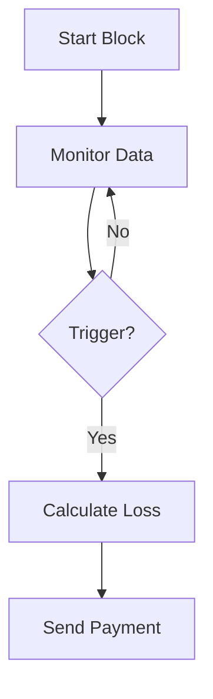
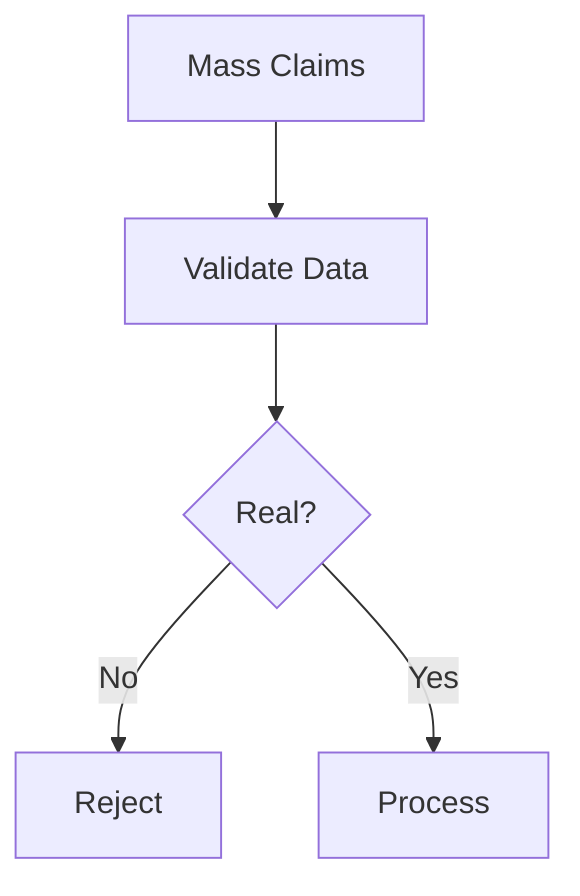
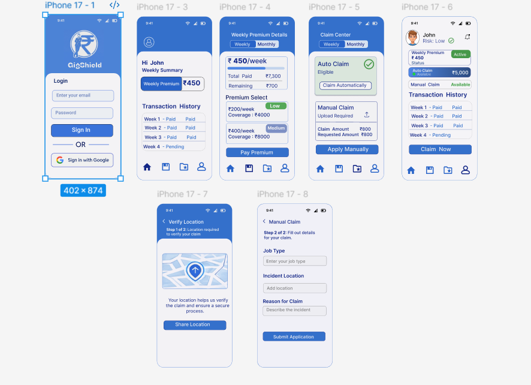

# 🛡️ GigShield: Parametric AI Insurance for the Gig Economy
Subtitle: Defending Income. Detecting Fraud. Surviving Market Volatility.

---

## 📌 1. Executive Summary
GigShield is an AI-driven parametric insurance platform engineered to provide a financial safety net for gig workers—specifically Amazon Flex delivery partners. By leveraging real-world environmental data (weather, pollution, traffic), GigShield automates income protection. Unlike traditional insurance, it utilizes a Zero-Touch Model, triggering instant payouts without manual claims or human verification.

---

## 🚨 2. The Problem Landscape

### 2.1 Environmental Volatility
India’s gig workforce is highly susceptible to "Acts of God" and urban disruptions such as rainfall, AQI spikes, and traffic congestion.

**Impact:**
- Loss of working hours
- 20–30% income reduction
- No safety net

### 2.2 Fraud Risk ("Market Crash")
GPS-based systems can be exploited using fake GPS apps, leading to mass fraudulent claims.

---

## 💡 3. The Solution: GigShield

GigShield provides **automatic income protection** using a parametric model.

### 👤 Persona: Amazon Flex Driver

- 4-hour block (₹500)
- If disruption occurs:
  - 2 hours lost → ₹250 payout
  - 3 hours lost → ₹375 payout

---

## 📊 Key Disruption Factors

| Disruption Type        | Insurance Trigger (Reason)                                                | API Used |
|----------------------|---------------------------------------------------------------------------|----------|
| 🌧️ Extreme Weather   | Heavy rain, flooding                                                      | OpenWeatherMap |
| 🌫️ Environmental     | AQI > 400                                                                 | WAQI |
| 🔥 Extreme Heat      | Temperature > 42°C                                                        | Meteostat |
| 🚦 Traffic/Social    | Traffic congestion / strikes                                              | TomTom |

---

## 👤 Persona-Based Scenario

Ravi books a delivery block from 4 PM – 8 PM.

- Completes deliveries until 5 PM
- Heavy rain starts
- Cannot continue

👉 Remaining 3 hours lost  
👉 GigShield pays ₹375 instantly

---

## 💰 Weekly Pricing Model

| Plan | Premium | Coverage |
|------|--------|---------|
| Basic | ₹30/week | ₹3,000 |
| Standard | ₹60/week | ₹6,000 |
| Premium | ₹100/week | ₹10,000 |

### AI Pricing Formula:
Premium = Base + Risk Factor

---

## 🧠 AI-Powered Risk Assessment

- Predicts disruption risk
- Adjusts premiums
- Identifies high-risk zones

---

## ⚙️ 4. Operational Workflow

1. User registers
2. Selects plan
3. Starts delivery block
4. System monitors conditions
5. Trigger detected
6. Payout calculated
7. Instant payment

---

## 🔄 Workflow Diagram

---

## 🧠 5. Fraud Detection

- GPS not trusted
- Uses route + scan data
- Detects anomalies

### Fraud Risk Score:
- 0–30 → Safe
- 31–70 → Review
- 71–100 → Block

---

## 💣 Market Crash Handling

---

## 🛠️ Manual Claim (Fallback)

If system misses:
- User submits claim
- AI verifies data
- Approves/rejects

---

## 🧾 Onboarding Flow

1. Register
2. Link account
3. Choose plan
4. Pay premium
5. Coverage active

---

## 📊 Analytics Dashboard

### Worker:
- Earnings protected
- Claim history

### Admin:
- Loss ratio
- Risk zones

---

## 🛠️ Tech Stack

Frontend: React.js, Tailwind  
Backend: Node.js, FastAPI  
Database: MongoDB  
APIs: Weather, AQI, Traffic  
Payments: Razorpay (mock)

---

## 📊 Impact

### Worker:
- Income protection
- Safety assurance

### Platform:
- Fraud prevention
- Automation

---

## 🚀 Future Scope

- ML pricing
- Multi-platform expansion
- Predictive alerts

---

## 🎨 UI Prototype

Figma Link:
https://www.figma.com/design/B6ifyhqy4hdmvEMsvTUGfU/Guidewire-hack

  

---

## 🎯 Conclusion

GigShield ensures:
- Zero-touch claims
- Fraud-proof system
- Reliable income protection

---

**GigShield — Protecting Work. Preventing Fraud. Powering Trust.**
